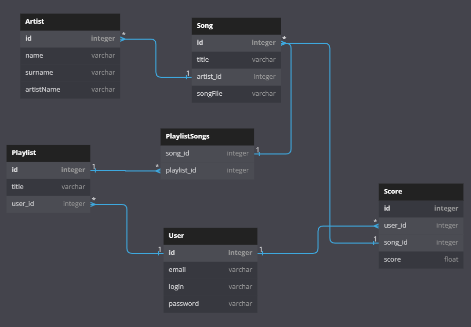

# *Protify - Music Player*

## Project created and maintained for the SKW - Frameworks course


### This project features a music player API with functionalities like:

#### As a user

- Creating your own account
- Searching and getting your favourite music
- Creating and updating your playlists
- Giving your music your personal score

#### As an administrator

- Permision for CRUD operations on every single entity


## Technologies used
- Spring Boot
- PostgreSQL
- Swagger
- Spring Security

## Team
- Łukasz Bociański
- Gabriel Maruszewski
- Patryk Wałach

---

## Docker PostgreSQL

*Docker initialization command*

```
docker run --name protify -e POSTGRES_PASSWORD= -e POSTGRES_DB=protify -e POSTGRES_HOST_AUTH_METHOD=trust -p 32770:5432 -d postgres
```

*H2 Console*

Go to: http://localhost:8080/h2-console

- **Saved Settings:** Generic PostgreSQL
- **Setting Name:** Generic PostgreSQL
- **Driver Class:** org.postgresql.Driver
- **JDBC URL:** jdbc:postgresql://localhost:32770/protify
- **User Name:** postgres
- **Password:**

---

## Database

*Models and relations*



---

 
